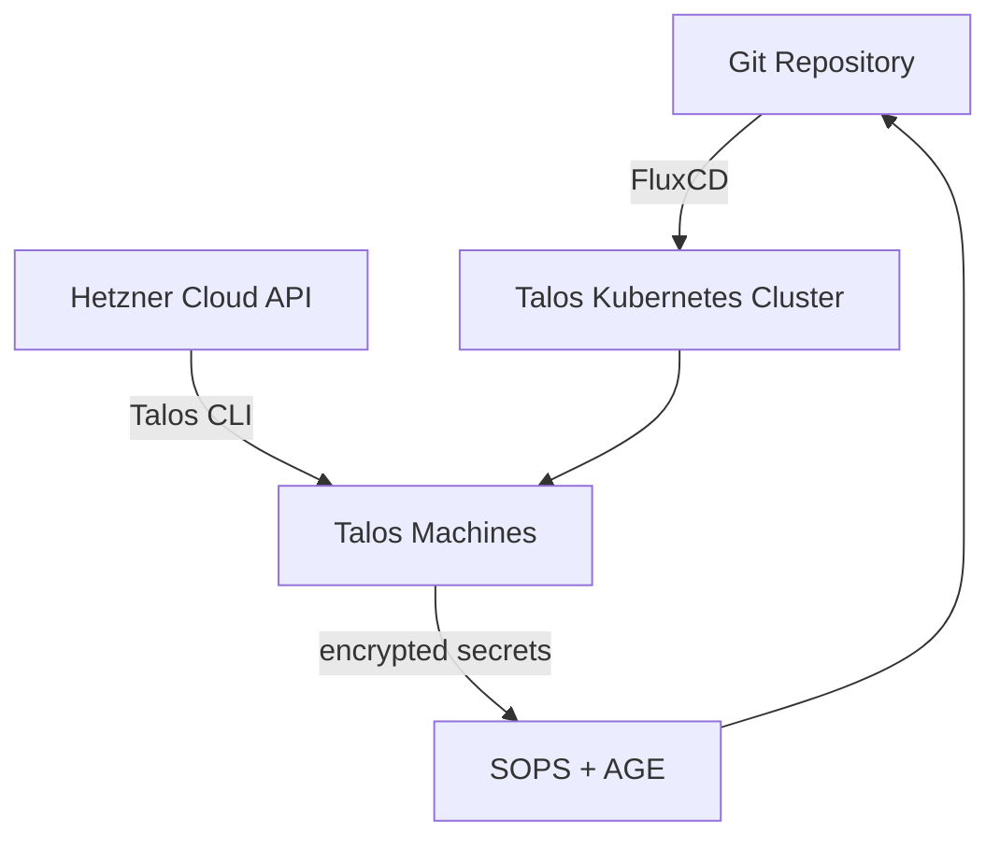

# talos-k8s-hcloud

[](https://opensource.org/licenses/MIT)
[](https://github.com/dysonfrost/talos-k8s-hcloud/commits/main)
[](https://kubernetes.io)
[](https://www.talos.dev)

**GitOps-managed Talos Linux + Kubernetes cluster on Hetzner Cloud**

A minimal, production‑ready setup that turns your Hetzner Cloud environment into a fully GitOps‑driven Kubernetes cluster.  
No more snowflake servers or configuration drift, everything is defined in code and continuously reconciled.

## Why this project

- **Immutable OS for Kubernetes** - Talos Linux is minimal, secure, and API‑managed: no SSH, no manual patching, no ad‑hoc configuration drift.
- **Reproducible infrastructure as code on Hetzner Cloud** - full lifecycle of machines + cluster resources lives in Git.
- **GitOps‑driven cluster operation** - cluster state (node configs, Kubernetes manifests, add‑ons) is driven by Git, enabling traceability, rollbacks, and auditability.
- **Best‑practice Kubernetes setup** - designed for production‑grade deployments, with the ability to extend with networking, storage, backups, metrics, etc.

## Architecture



The cluster is provisioned on Hetzner Cloud and consists of:

- [Talos Linux](https://www.talos.dev) for an immutable, API‑driven operating system
- [FluxCD](https://fluxcd.io/) for continuous reconciliation of all Kubernetes resources
- [SOPS](https://github.com/getsops/sops) + [AGE](https://github.com/FiloSottile/age) for secure, encrypted secret management
- A tooling container to provide a reproducible operations environment
- [OpenObserve](https://openobserve.ai) for centralized logs, metrics, and traces
- [Local Path Provisioner](https://github.com/rancher/local-path-provisioner) for dynamic storage provisioning
- [RustFS](https://github.com/rustfs/rustfs) for additional storage capabilities
- [RenovateBot](https://github.com/renovatebot/renovate) for automated dependency and image updates

This repository serves as the single source of truth for cluster state.

## Repository structure

```
/
├── machineconfigs/   # Talos machine configurations
├── manifests/        # Kubernetes manifests and optional add‑ons
├── packer/           # Packer templates to build Talos images
├── tools/            # Small utility scripts used during provisioning and maintenance
├── .sops.yaml        # Secrets encryption config
├── justfile          # Runs a portable containerized tool environment
├── kubeconfig        # Encrypted kubeconfig for cluster access
├── renovate.json     # Schema for Renovate bot
├── secrets.yaml      # Talos secrets bundle file
├── talosconfig       # Encrypted Talos config for talosctl
└── README.md
```

## Requirements

- [Hetzner Cloud API Token](https://docs.hetzner.com/cloud/api/overview/)
- [age private key](https://github.com/FiloSottile/age) for SOPS decryption
- Docker (for tooling container)

## Getting started

These steps will bring up a production‑ready Talos cluster on Hetzner Cloud in minutes.

```bash
# 1. Clone the repository
git clone https://github.com/dysonfrost/talos-k8s-hcloud.git
cd talos-k8s-hcloud

# 2. Configure your secrets (replace with your real values)
export HCLOUD_TOKEN="your_hetzner_api_token"
export AGE_PUBLIC_KEY="age_public_key_here"
export AGE_PRIVATE_KEY="age_private_key_here"

# 3. Build and run the tooling container
just tools

# Inside the container, you now have talosctl, kubectl, flux, helm, etc.
# 4. (Optional) Generate new Talos secrets and encrypt them
talosctl gen secrets | sops --encrypt --input-type yaml --output-type yaml > secrets.yaml

# 5. Apply machine configurations and bootstrap the cluster
# (Follow the exact steps described in the `machineconfigs/` directory)
```

After bootstrapping, FluxCD will automatically reconcile all manifests in the `manifests/` directory.

## `just` — portable tool environment

The `justfile` builds and runs a Docker container that includes:

- `kubectl`
- `talosctl`
- `flux`
- `helm`
- `yq`
- and the required config files (kubeconfig, talosconfig)

This allows you to:

- access and manage the cluster from **any machine**
- avoid manually installing CLI tools locally
- keep your environment consistent and reproducible

### Usage

```bash
# Build and start a container with all required tools installed
just tools
```

Once inside the container you can run commands normally:

```bash
kubectl get nodes
talosctl version
flux get kustomizations
```

## Tools

The `tools/` directory contains small helper scripts used while setting up or maintaining the cluster.  
These are intentionally lightweight and optional to simply automate some common steps.

## Secrets

Sensitive data is stored using SOPS with AGE keys.

To edit or decrypt secrets:

```bash
sops --encrypt --in-place --input-type yaml --output-type yaml talosconfig
sops --encrypt --in-place --input-type yaml --output-type yaml kubeconfig
sops --encrypt --in-place somefile.yaml
```

Make sure to decrypt a file before editing it, to avoid conflicts with MAC signature.

```bash
# Default private key location should be:
# $HOME/.config/sops/age/keys.txt
#
# If not set, use SOPS_AGE_KEY_FILE environment variable.
sops --decrypt --in-place --input-type yaml --output-type yaml talosconfig
sops --decrypt --in-place --input-type yaml --output-type yaml kubeconfig
sops --decrypt --in-place somefile.yaml
```

### Key management

- Ensure you have the correct AGE private key available on your workstation.
- Store a second AGE private key inside the cluster as a Kubernetes secret named `sops-age` in the `flux-system` namespace.

## Troubleshooting

| Problem | Likely cause | Suggested fix |
|---------|--------------|----------------|
| `talosctl` cannot connect to nodes | Missing or expired Talos config | Regenerate `talosconfig` and encrypt it with SOPS |
| Cluster stays in `NotReady` after bootstrap | Network policy or CNI not deployed | Check that `manifests/` includes a CNI (e.g., Cilium, Calico) and Flux has reconciled it |
| SOPS decryption fails | Wrong AGE private key | Verify `SOPS_AGE_KEY_FILE` points to the correct key file |
| `just tools` fails | Docker not running or image not built | Start Docker and run `just build-tools` first |

## Contributing

Issues and pull requests are welcome.  
For major changes, please open an issue first to discuss what you would like to change.  
Make sure to update tests and documentation accordingly.

## License

MIT © [Jérémy Reisser](https://github.com/dysonfrost)
